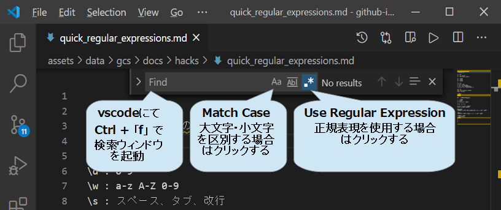

# 正規表現のとりあえず知っておきたい使い方

## vscodeで正規表現を使う

vscodeの検索機能で正規表現を使用でき便利です。  

次の手順で、使用できます。  

1. vscode を起動する  
2. 「ctrl」+「f」で検索ウインドウを起動する  
3. 検索ボックス右の「.*」(Use Regular Expressions)をクリックして オンにする  
4. 検索ボックス右の「Aa」(Match Case)をクリックして オフにする（大文字、小文字を区別しない場合）  

コード|意味|使用例|
:--|:--|:--|
. | 改行を除く任意の1文字 | |
\ | エスケープ | 「.」を探す: **\\.**|
\d | 0-9 | |
\w | a-z A-Z 0-9
\s | スペース、タブ、改行
\D | \d以外
\W | \w以外
\S | \s以外
\t | タブ
\r\n | 改行 win
\r | 改行 v9までもmacos
\n | 改行 unix v10以降のmacos
\r\n\|\r\|\n | 改行 すべてのosに対応

重量演算子 | 意味 | 使用例 |
:--|:--|:--|
{n} | n個 | \d{4}: 1234 |
{min, max} | min以上, max以下 | \d{1,2}: 1, 23 |
{min,} | min以上 | \d{2,}: 12, 345 |
? | {0,1} | \d? |
\+ | {1,} | \d+ |
\* | {0,} | \d* |

量? :一番短い文字列でmatch

重量演算子 | 意味 | 使用例 |
:--|:--|:--|
^ | 行の先頭 | |
$ | 行の末尾 | |
\b | 単語の境界 |　\bkg1\b |
s1\|s2 | s1 or s2
(s1\|s2) | s1 or s2
(b\|c\|g) | b,c,gのどれか1文字
[bcg] | b,c,gのどれか1文字

単語 | 意味 | 使用例 |
:--|:--|:--|
キャプチャ | ()でくくった内容を 置換などで順番に$1, $2,・・・で参照できる | |
後方参照 | ()でくくった内容を 後方で \1, \2, ・・・で参照できる | |

## []内でのメタ文字

単語 | 意味 | 使用例 |
:--|:--|:--|
^ | 否定([の直後) | |
\- | 範囲 | |
\^, \-, \], \\
